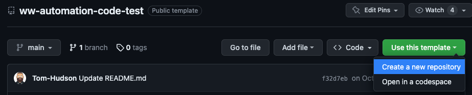
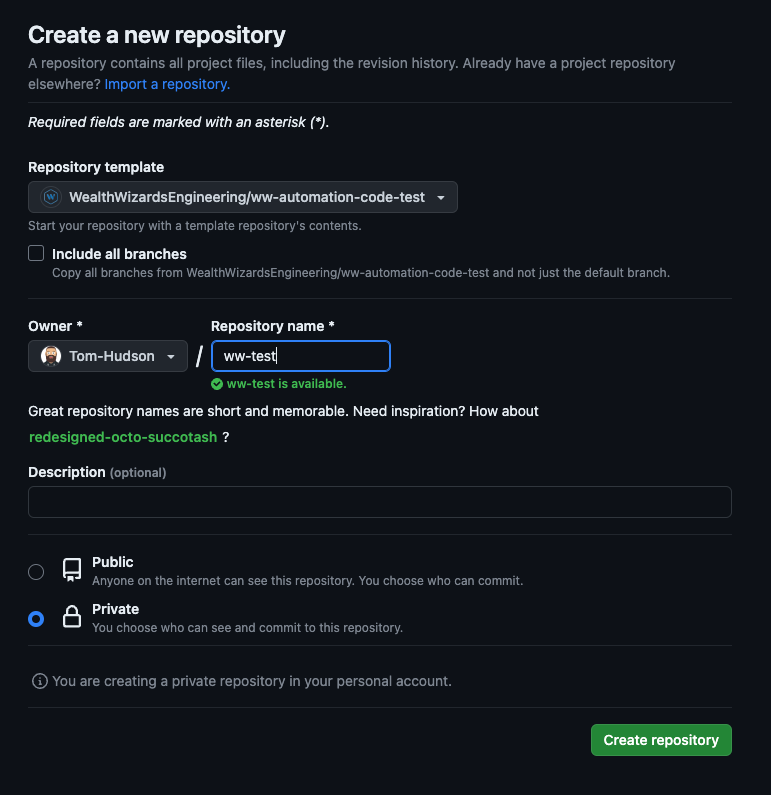

# ww-automation-code-test
In this repo you will find 2 challenges which will give us a starting point for conversations during your technical interview.

You should be able to complete the test in under 2 hours, however if you wish to continue beyond that, we welcome you to do so. The amount of time you take is not factored into consideration and will have no impact on your submission.

We do not expect you to create absolute perfection, a 'quick and dirty' solution will suffice as this will create conversation points for the interview.

## Instructions
1. Click the **Use this template** button above to create a new private repository in your own GitHub account.

2. Invite GitHub user **@Tom-Hudson** as a collaborator on your new private repo
3. Create a new branch and complete both parts of the test
4. Once finished, raise an pull request, adding **@Tom-Hudson** as a reviewer
> Please add a simple description to your PR and any comments you feel support your submission.

### Part 1: Cypress
Setup a [Cypress](https://docs.cypress.io/guides/getting-started/installing-cypress) project in the `/part-1` folder and automate the below scenario:
1. Go to https://www.saucedemo.com/v1/
2. Login successfully with the credentials provided on the webpage
3. Sort the inventory by `price (high to low)`
4. Check that the items are sorted correctly
5. Add 2 items to the cart
6. Assert the item counter on the cart in the top right has the value `2`
7. Navigate to the cart page
8. Assert the cart page contains the 2 items
9. Complete checkout, asserting that you are given `FREE PONY EXPRESS DELIVERY!`
10. Assert your order has been successful

> We would likely never create a test like this 👆 at Wealth Wizards. The purpose of this is to demonstrate your automation abilities. If there are any steps you cannot complete, that is fine and can be discussed in the interview.

### Part 2: Cucumber
Create a Cucumber feature file in the `part-2` folder and add tests for the current UK income tax bands:
* UK income tax bands - https://www.gov.uk/income-tax-rates
* Gherkin Reference - Cucumber Documentation: https://cucumber.io/docs/gherkin/reference/   
> We understand the project won’t have the step definitions for the feature file to work, we are only interested in the scenarios you create